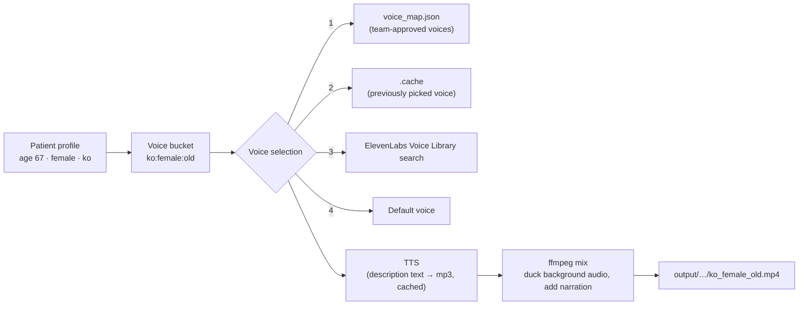

# Personalized Exercise Voice-over (Prototype)

A prototype that narrates exercise-video instructions in a voice matched to the patient's **age, gender and app language**. It uses the [ElevenLabs API](https://elevenlabs.io/docs/api-reference) for text-to-speech and voice search.

## How it works



1. **Profile → bucket**: Age is grouped into `young` (<35) / `middle_aged` (35–59) / `old` (60+). The bucket names match the ElevenLabs Voice Library `age` filter values.
2. **Voice selection** (in priority order)
   1. A voice id the team has listened to and approved in `config/voice_map.json`
   2. The voice picked on a previous run (`.cache/voice_cache.json`), so a bucket always gets the same voice
   3. Voice Library search, relaxing filters from `language+gender+age` → `language+gender` → `gender+age`, preferring voices verified for the target language
   4. A default voice per gender
3. **TTS**: Reads the localized description text the app already has, as-is (no translation). The cache key covers text, voice, model and speed, so each combination is billed only once.
4. **Video mix**: Lowers the original background audio to 15% and starts the narration after 0.5 s. If the narration is longer than the video, speech is first sped up to at most 1.1×; anything still left over is covered by holding the last frame.

### Why per bucket instead of per patient?

- **Cost and speed**: You only render exercises × languages × 2 genders × 3 age bands, so everything can be pre-rendered and served from a CDN (`voicedub prerender`). The app never calls the API at playback time.
- **Privacy**: Only exercise description text is sent to ElevenLabs. No patient information leaves the system, not even at bucket level.
- **Quality control**: With roughly 18 buckets, a clinical/content team can listen to each voice and lock it in via `voice_map.json`.

## Setup

Requirements: Python 3.9+, ffmpeg, an ElevenLabs API key

```bash
brew install ffmpeg
```

```bash
python3 -m venv .venv && source .venv/bin/activate
```

```bash
pip install -e ".[demo,dev]"
```

```bash
cp .env.example .env   # add your ELEVENLABS_API_KEY
```

If you don't have real exercise videos, generate test-pattern clips:

```bash
./scripts/make_sample_videos.sh
```

## Usage

Run all commands from the repository root.

**See which voice a patient would get** (includes a preview URL)

```bash
voicedub voice --age 67 --gender female --lang ko
```

**Dub a video for one patient**

```bash
voicedub dub --exercise glute_bridge --age 67 --gender female --lang ko
```

Options: `--video PATH` (use a specific video), `--replace-audio` (drop the original audio), `--lead-in 1.0`, `--no-fit` (no speed adjustment), `--gender other --fallback-gender male`

**Pre-render every bucket**

```bash
voicedub prerender --langs ko,en,ja
```

**User-testing demo**: Generates audio only (MP3, no video) so you can compare the personalized voice with the default voice side by side and download both.

```bash
streamlit run demo/app.py
```

**Tests**

```bash
pytest
```

## Replacing the sample data

- `data/exercises.json`: Exercise ids, localized titles/descriptions and video paths. It ships with 3 samples; replace them with your app's real localized copy.
- `videos/`: Where exercise videos go. **Not committed to git** (`.gitignore`).
- `config/voice_map.json`: Approved voice ids per bucket. Put the voice your app uses today under `defaults` to make it the demo's "Default voice" baseline.

## Limitations and next steps

- **Voice ≠ person**: Only the voice changes for now. Matching the on-screen person too would need per-bucket instructor footage or avatars. This prototype's goal is to first check whether voice alone makes a difference.
- **Uneven Voice Library coverage**: Some combinations (e.g. older Korean voices) have few options and may fall back to the `any_age` / `any_language` levels. Check `source` in the output. ElevenLabs Voice Design (creating a voice from a text description, e.g. "a calm Korean woman in her 60s") is worth exploring as an alternative.
- **Medical term pronunciation**: Anatomy and exercise terms may be mispronounced, so listen to every clip before shipping.
- **Licensing**: Check the commercial-use terms for Voice Library voices (plan requirements, per-voice rates).
- **Disclosure**: Decide how the app will tell patients the voice is AI-generated.
- **Suggested metrics**: A/B test personalized vs. default voice on exercise completion rate, watch-to-end rate, weekly return rate, and a 5-point relatability survey.
- **"Other" gender**: Currently handled with `--fallback-gender`. In the real app, letting patients choose their voice is a better fit.
