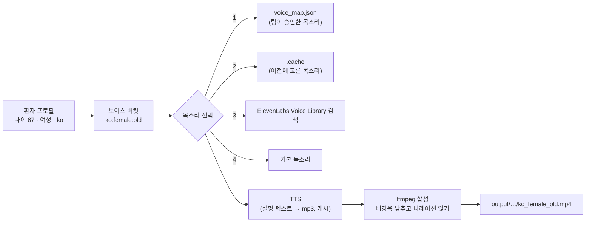

# 운동 영상 맞춤 음성 더빙 (프로토타입)

환자의 **나이 · 성별 · 앱 언어**에 맞는 목소리로 운동 영상의 설명(description)을 더빙하는 프로토타입입니다. TTS와 목소리 검색에는 [ElevenLabs API](https://elevenlabs.io/docs/api-reference)를 사용합니다.

## 동작 방식



1. **프로필 → 버킷**: 나이는 `young`(<35) / `middle_aged`(35–59) / `old`(60+)로 묶습니다. 버킷 이름은 ElevenLabs Voice Library의 `age` 필터 값과 같습니다.
2. **목소리 선택** (우선순위 순)
   1. `config/voice_map.json`에 팀이 직접 듣고 승인한 voice id
   2. 이전 실행에서 고른 목소리 (`.cache/voice_cache.json`) — 같은 버킷은 항상 같은 목소리
   3. Voice Library 검색 — `언어+성별+연령` → `언어+성별` → `성별+연령` 순으로 조건을 완화하고, 해당 언어가 검증(verified)된 목소리를 우선합니다
   4. 성별별 기본 목소리
3. **TTS**: 앱에 이미 있는 언어별 설명 텍스트를 그대로 읽습니다(번역하지 않음). 텍스트·목소리·모델·속도로 캐시 키를 만들어 같은 조합은 한 번만 과금됩니다.
4. **영상 합성**: 원본 배경음을 15%로 낮추고 0.5초 뒤 나레이션을 시작합니다. 나레이션이 영상보다 길면 먼저 최대 1.1배까지 말 속도를 높이고, 그래도 넘치면 마지막 프레임을 정지 화면으로 늘립니다.

### 왜 환자별이 아니라 "버킷별"인가요?

- **비용·속도**: 운동 수 × 언어 × 성별 2 × 연령대 3 만큼만 렌더링하면 되므로 미리 만들어 CDN에 올릴 수 있습니다 (`voicedub prerender`). 앱은 재생 시점에 API를 부를 필요가 없습니다.
- **개인정보**: ElevenLabs로는 운동 설명 텍스트만 전송되고, 환자 정보는 버킷 수준에서도 외부로 나가지 않습니다.
- **품질 관리**: 버킷이 18개 내외라 임상/콘텐츠 팀이 목소리를 직접 들어보고 `voice_map.json`에 확정할 수 있습니다.

## 설치

필요한 것: Python 3.9+, ffmpeg, ElevenLabs API 키

```bash
brew install ffmpeg
```

```bash
python3 -m venv .venv && source .venv/bin/activate
```

```bash
pip install -e ".[demo,dev]"
```

```bash
cp .env.example .env   # ELEVENLABS_API_KEY 입력
```

실제 운동 영상이 없다면 테스트 패턴 영상을 만들어 쓸 수 있습니다.

```bash
./scripts/make_sample_videos.sh
```

## 사용법

모든 명령은 저장소 루트에서 실행합니다.

**어떤 목소리가 배정되는지 확인** (미리듣기 URL 포함)

```bash
voicedub voice --age 67 --gender female --lang ko
```

**환자 한 명 기준으로 영상 더빙**

```bash
voicedub dub --exercise glute_bridge --age 67 --gender female --lang ko
```

옵션: `--video 경로`(영상 지정), `--replace-audio`(원본 소리 제거), `--lead-in 1.0`, `--no-fit`(속도 조절 끄기), `--gender other --fallback-gender male`

**전체 버킷 미리 렌더링**

```bash
voicedub prerender --langs ko,en,ja
```

**사용자 테스트용 데모** — 영상 없이 음성(MP3)만 생성해 맞춤 목소리와 기본 목소리를 나란히 비교하고 다운로드할 수 있습니다.

```bash
streamlit run demo/app.py
```

**테스트**

```bash
pytest
```

## 데이터 교체하기

- `data/exercises.json` — 운동 id, 언어별 제목/설명, 영상 경로. 샘플 3개가 들어 있으니 앱의 실제 현지화 문구로 바꿔주세요.
- `videos/` — 운동 영상 위치. **git에 올라가지 않습니다** (`.gitignore`).
- `config/voice_map.json` — 버킷별로 승인한 voice id. `defaults`에 현재 앱에서 쓰는 목소리를 넣으면 데모의 "기본 목소리" 비교 대상이 됩니다.

## 한계와 다음 단계

- **목소리 ≠ 사람**: 지금은 음성만 바꿉니다. "나와 비슷한 사람"까지 가려면 버킷별 강사 영상 촬영이나 아바타가 필요합니다. 먼저 음성만으로 효과가 있는지 검증하는 것이 이 프로토타입의 목적입니다.
- **Voice Library 품질 편차**: 한국어 고령 목소리는 선택지가 적어 `any_age`/`any_language` 단계로 내려갈 수 있습니다. 출력의 `source`를 보고 확인하세요. 대안으로 ElevenLabs Voice Design(텍스트 설명으로 목소리 생성, 예: "차분한 60대 한국 여성")을 검토해볼 만합니다.
- **의료 용어 발음**: 해부학·운동 용어가 틀리게 읽힐 수 있어 배포 전 청취 검수가 필요합니다.
- **라이선스**: Voice Library 목소리의 상업적 사용 조건(요금제, 목소리별 요율)을 확인해야 합니다.
- **고지**: AI 생성 음성임을 앱에서 어떻게 알릴지 정해야 합니다.
- **검증 지표 제안**: 맞춤/기본 목소리 A/B로 운동 완료율, 영상 끝까지 시청 비율, 주간 재방문, 동질감 설문(5점 척도)을 비교.
- **"기타" 성별**: 현재는 `fallback-gender`로 처리합니다. 실제 앱에서는 환자가 목소리를 직접 고르게 하는 편이 낫습니다.
